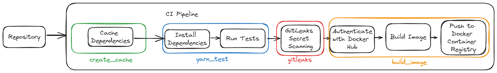

# devsecops-bootcamp

Demo projects and notes while following along the course.

## Project 1

Reference: Module 3 - Application Vulnerability Scanning

### Description

Setup a CI pipeline and pre-commit script to scan for secrets using [GitLeaks](https://github.com/gitleaks/gitleaks).

- Configure GitLeaks job in CI to check commits for secrets.
- Create a Git pre-commit hook script that runs GitLeaks using Docker, and performs GitLeaks scan before the code is committed.

### Technologies Used

- Uses the juice-shop repository found [here](https://gitlab.com/twn-devsecops-bootcamp/latest/juice-shop.git) on branch `feature/starting-code` as a submodule.
- GitHub workflow, GitLeaks, Git

### Overview

The pipeline `project-1.yml` can be found under .github/workflows.

## Project 2
