# devsecops-bootcamp

Demo projects and notes while following along the course.

## Part 1

### Project 1 - Setup Secrets Scanning in GitLab CI and Pre-Commit Script using GitLeaks

**Reference**: Module 3 - Application Vulnerability Scanning

**Description**: Set-up a CI pipeline and pre-commit script to scan for secrets using [GitLeaks](https://github.com/gitleaks/gitleaks).

- Configure GitLeaks job in CI to check commits for secrets.
- Create a Git pre-commit hook script that runs GitLeaks using Docker, and performs GitLeaks scan before the code is committed.

**Used technologies**:

- Uses the juice-shop repository found [here](https://gitlab.com/twn-devsecops-bootcamp/latest/juice-shop.git) on branch `feature/starting-code` as a submodule.
- GitHub workflow, GitLeaks, Git

**Overview**: The pipeline `project-1.yml` can be found under `.github/workflows`.
The pre-commit hook `project-1-pre-commit.sh` is available in the root folder of this repository.


### Project 2 - Setup Static Application Security Scanning in GitLab CI using NJSScan & Semgrep

**Reference**: Module 3 - Application Vulnerability Scanning

**Description**: Set-up a CI pipeline for Static Application Secret Testing (SAST) using NJSScan and Semgrep:

- Configure NJSScan in CI to run SAST scan against repository code.
- Configure Semgrep in CI to run additional SAST scan against repository code.

**Used technologies**:

- [NJSScan](https://github.com/ajinabraham/njsscan)
- Semgrep
  - **Note**: Uses [`semgrep scan`](<https://semgrep.dev/docs/getting-started/cli-oss>) instead of `semgrep ci` due to changes in the dependency.
- GitHub workflow, Git

**Overview**: The pipeline `project-2.yml` can be found under `.github/workflows`.

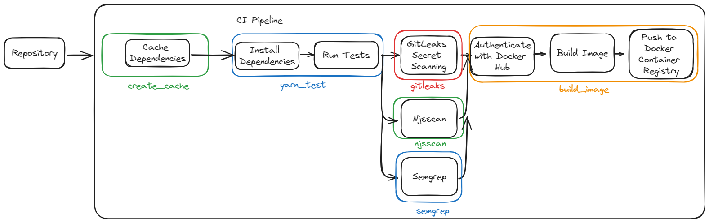

### Project 3 - Upload Security Scan Results Automatically to DefectDojo

**Reference**: Module 4 - Vulnerability Management and Remediation

**Description**: Create a Python script that automatically uploads security scan findings to DefectDojo, a vulnerability management tool, using CI.

- Create a Python script that connects to DefectDojo via API key
- Create a Python script to upload GitLeaks, Semgrep, and NJSScan files from CI security scanning jobs to DefectDojo
- Add a new job in CI pipeline to run the Python script to upload findings to DefectDojo as part of the pipeline execution.

**Used technologies**:

- [DefectDojo](https://defectdojo.github.io/django-DefectDojo/getting_started/demo/)
  - **Note**: You might need to re-generate a new API v2 key via the [DefectDojo demo webpage](https://demo.defectdojo.org/api/key-v2).

**Overview**: The pipeline `project-3.yml` can be found under `.github/workflows`.


### Project 4 - Remediate Weak Cryptography and SQL Injection Vulnerabilities in Application based on Security Findings

**Description**: Review NJSScan and Semgrep security findings in DefectDojo,
then remediate weak cryptography and SQL injection vulnerabilities in application code.

- Update application code to remediate weak hash function (e.g. juice-shop\Gruntfile.js - md5 checksum), based on NJSScan security finding in DefectDojo
- Update application code to remediate SQL injection vulnerability, based on Semgrep security findings in DefectDojo.

**Used technologies**:

- JavaScript
- DefectDojo
- Git
- GitHub
- Semgrep
- NJSScan

### Project 5 - Setup SCA Scanning using RetireJS and Upload Findings to DefectDojo

**Reference**: Module 5 - Vulnerability Scanning for Application Dependencies

**Description**: Set-up Software Composition Analysis (SCA) scanning in CI and automatically upload scan reports to DefectDojo.

- Create a new job in the CI pipeline for automated SCA scanning using RetireJS
- Configure the job to save the SCA scan report as an artifact
- Upload the RetireJS scan report to DefectDojo using Python automation script

**Used technologies**:

- DefectDojo
- RetireJS

**Overview**: The pipeline `project-5.yml` can be found under `.github/workflows`.


### Project 6 - Upload Images to AWS ECR using CI/CD Pipeline

**Reference**: Module 6 - Build a CD Pipeline

**Description**: Configure CI pipeline with AWS user credentials to upload images to AWS ECR via CI/CD pipeline.

- Create access keys for user in AWS IAM
- Add AWS access keys as CI secrete environment variables for use in the pipeline
- Update CI pipeline to build and push Docker images to ECR using the AWS access keys

**Used technologies**:

- AWS IAM
- AWS ECR
- GitHub Workflow

**Overview**: The pipeline `project-6.yml` can be found under `.github/workflows`.


### Project 7 - Deploy Application to EC2 Instance using CI/CD Pipeline

**Reference**: Module 6 - Build a CD Pipeline

**Description**: Deploy application to AWS EC2 instance using CI/CD pipeline.

- Configure EC2 instance with Docker and ECR credentials
- Create new deployment job in CI that automatically:
  - Connects to EC2 instance using SSH
  - Pulls latest Docker images from AWS ECR
  - Stops previous running container, if applicable
  - Runs latest Docker container

**Used technologies**:

- AWS IAM
- AWS EC2
- GitHub Workflow
- Docker

**Overview**: The pipeline `project-7.yml` can be found under `.github/workflows`. The required configuration can be found under `project-7/configure.sh`.


### Project 8 - Use Self-Managed Runners for CI/CD

**Reference**: Module 6 - Build a CD Pipeline

**Description**: Create an EC2 instance and configure it as a GitHub CI/CD self-managed runner.

- Create new AWS EC2 instance
- Register the EC2 instance with GitHub CI/CD as a self-hosted runner
- Configure EC2 instance as a GitHub runner with Shell executor instead of Docker executor

**Used Technologies**:

- AWS EC2
- GitHub CI/CD

**Overview**: The required configuration can be found under `project-8/configure.sh`.


### Project 9 + 10 - Scan Docker Images using Trivy with CI/CD Pipeline + Upload Trivy Image Scanning Results to DefectDojo using CI/CD Pipeline

**Reference**: Module 7 - Image Scanning - Build Secure Docker Images

**Description**: Update CI/CD pipeline to perform Docker image scanning using Trivy and upload Trivy image scan results to DefectDojo

- Create a new job in CI/CD pipeline that:
  - Pulls docker image from private AWS ECR
  - Runs Trivy image scan on the image
  - Fails Trivy job only if high or critical level security findings are detected
- Updates Trivy job to export image security findings reported as pipeline artifacts
- Updates Python script to automatically upload Trivy security findings to DefectDojo
- Update upload reports job to execute Python upload script for Trivy scan reports

**Used technologies**:

- Trivy
- Python
- DefectDojo
- Git
- GitHub Workflow
- Docker
- AWS ECR

**Overview**: The pipeline `project-9+10.yml` can be found under `.github/workflows`.


The pipeline uses the AWS IAM access keys of the `github` user instead of the `root` user as defined in Project 11.

Container deployed to the EC2 instance `app-server` from `github-runner`:


Juice-shop available via public ip of EC2 instance on port 3000:


### Project 11 - Create CI User Account using AWS IAM

**Reference**: Module 9 - Secure Continuous Deployment & DAST

**Description**: Create a dedicated AWS IAM user for CI/CD with least priviliges accesss to securely upload image to AWS ECR.

- Create AWS IAM user for CI/CD and assign permission policy for ECR access only
- Configure CI/CD user with only AWS CLI access
- Create AWS CLI access keys for the `github` user
- Update CI/CD to use the `github` user access keys instead of the admin user keys

**Used technologies**:

- AWS IAM
- GitHub Workflow

**Overview**: Dedicataed AWS IAM user for CI/CD.


### Project 12 - Use AWS SSM to Deploy Application to EC2 Instance

**Reference**: Module 9 - Secure Continuous Deployment & DAST

**Description**: Create new EC2 role to allow more secure access from CI/CD using AWS SSM instead of SSH.

- Remove SSH firewall rule from AWS EC2 security group
- Create new IAM role for EC2 instance with `SSMManagedInstanceCore` policy, assign the role to EC2 instance for SSM permission
- Remove SSH commands from CI pipeline
- Add SSM access policy to GitHub IAM user permissions
- Update GitHub workflow deploy job to:
  - Connect to private AWS ECR repository
  - Run docker image pull, stop, and run commands
  - Connect to EC2 instance with SSM and run docker application deployment commands

**Used technologies**:

- AWS IAM
- GitHub Workflow
- AWS EC2

**Overview**: Dedicated SSM roles (attached to both instances).


### Project 13 - Configure Automated DAST Scan in CI/CD Pipeline

**Reference**: Module 9 - Secure Continuous Deployment & DAST

**Description**: Create ZAP job in CI/CD pipeline to run automated
Dynamic Application Security Testing (DAST) scans.

- Configure CI pipeline to deploy to test and prod environments
- Create DAST job in CI:
  - Run automated ZAP scans against Docker application deployed on EC2 instance
  - Fail the ZAP job for security findings above the warning severity level
  - Export the ZAP scan results as pipeline artifacts

**Used technologies**:

- Zed Attack Proxy (ZAP)
- GitHub Workflow,
- Docker
- AWS

### Project 14 - Provision AWS Infrastructure Using Terraform

**Reference**: Module 10 - IaC and GitOps for DevSecOps

**Description**: Automate entire process of provisioning EC2 servers, AWS networking resources, IAM roles and permissions using Terraform.

- Create new IAM user for Terraform operations
- Create IAM roles with needed policies for application server and GitLab runner instances
- Create VPC and Security Group resources for EC2 networking
- Create and configure two EC2 instances:
  - Create application server with secure firewall configuration
  - Configure script to automatically install Docker and application dependencies on the application server
  - Create GitHub CI server with secure firewall configuration
  - Configure script to automatically install Docker and register the instance as a GitHub runner

**Used technologies**:

- Terraform
- Docker
- Git
- AWS (VPC, EC2, IAM)
- GitHub Workflow

**Overview**: Dedicated `iac-user`:


For S3 bucket access policies need to be added:


### Project 15 - Automate Security Scanning and Deployments for IaC

**Reference**: Module 10 - IaC and GitOps for DevSecOps

**Description**: Create a GitHub CI/CD pipeline for Terraform Infrastructure with built-in security scanning and code validation - GitOps

- Create AWS S3 bucket and configure Terraform to use bucket
for storing Terraform state
- Create new GitLab CI pipeline for Terraform infrastructure that:
  - Initializes Terraform and builds a plan artifact
  - Validates Terraform configuration and syntax
  - Runs a TFSec security scan on Terraform code and produces scan result artifact
  - Deploys the Terraform code to AWS

**Used technologies**:

- AWS S3
- GitHub Workflow
- Terraform
- Git
- TFSec

**Note**: TFsec seems to be part of trivy now, but it can be installed manually as seen in `.github/workflows/project-15.yml`.

### Project 16 - Create Multi-Region CloudTrail Trail and Forward Logs to CloudWatch

**Reference**: Module 11 - Logging & Monitoring for Security

**Description**: Create a trail in CloudTrail that captures events across all AWS regions and configure it to send event logs to CloudWatch.

- Create CloudTrail Trail that:
  - Forwards trail logs to new CloudWatch Log Group
  - Saves CloudTrail events to S3 bucket for all AWS regions
- Create filters on CloudTrail Trail events to quickly view events like failed login attempts
- Create filter in CloudWatch Log Group to quickly view logging metrics

**Used technologies**:

- AWS (S3, CloudTrail, CloudWatch)

**Overview**: Cloud-trail:


### Project 17 - Create CloudWatch Alarm for EC2 Instance

**Reference**: Module 11 - Logging & Monitoring for Security

**Description**: Create CloudWatch Alarm that sends an alert email when an EC2
instance has failed status checks for over five minutes

- Create new CloudWatch metric alarm that:
  - Checks if an EC2 instance failed status checks over a five minute period
  - Configure the metric to the “In alarm” state if this condition is met
  - Create a new SNS topic that sends an email when the metric is in the alarm state

**Overview**: Alarm overview:


After bringing down the EC2 instance using `ifconfig <interface> down` and waiting for some time:


### Project 18 - Create Custom Metric Filter and Alarm for Failed Console Logins

**Reference**: Module 11 - Logging & Monitoring for Security

**Description**: Create a custom metric filter in CloudWatch that checks for failed AWS console logins, create an alarm to notify when failed logins exceeds a threshold.

- Create Custom metric filter in CloudWatch log group that:
  - Checks for failed logins across entire log group
  - Creates new metric namespace for custom metric
  - Counts the number of failed login attempts
- Create CloudWatch alarm that:
  - Uses the custom metric filter to count failed login attempts over a 5 minute period, and triggers the alarm if there are more than 7 failures in that period
- Creates a new SNS topic that sends an email when the metric is in the alarm state

**Used technologies**:

- AWS (CloudWatch, SNS)

**Overview**: Alarm overview:


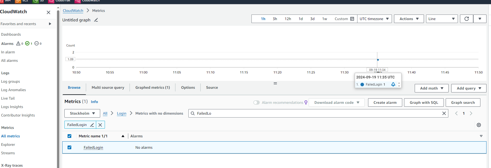


### Project 19 - Create AWS Billing Alarms

**Reference**: Module 11 - Logging & Monitoring for Security

**Description**: Create an AWS Budgets alarm that sends an email alert if AWS
costs exceed a threshold.

- Create AWS Budget that:
  - Sets a desired AWS monthly cost budget
  - Emails recipients when threshold is:
    - at 85% of actual budget spend
    - at 100% of actual budget spend
    - and if forecasted amount is expected to reach 100% of actual budget spend

**Used technologies**:

- AWS Budgets

**Overview**: I've actually have created this budget right in the beginning of the AWS journey:


---

## Part 2

### Project 20 - Provision EKS cluster with Secure Access Management

**Reference**:

- Module 12: Introduction to Kubernetes Security
- Module 13: Kubernetes Access Management with AWS EKS

**Description**: Provision EKS cluster with Secure Access Management for
developer and admin roles using Security Best Practices

- Infrastructure as Code configuration to:
  - Provision a base EKS cluster
- Add Configuration for Access Management:
  - Configure AWS IAM Roles for Access on AWS Level
  - Define Kubernetes Access with Role Based Access Control (RBAC) - creating K8s Roles and ClusterRoles
  - Configure Mapping between IAM Roles and K8s Users

**Used technologies**:

- AWS EKS
- AWS IAM
- Terraform
- Kubernetes

**Overview**: I've adjusted the cluster size to save cost.
The terraform files can be found under `project-20/` in the root folder.

**Validation**:

```bash
aws configure  // e.g. with the admin user
aws eks update-kubeconfig --name myapp-eks --region eu-north-1
kubectl get node
kubectl get pod -A
```

To connect with another user, create access keys and export them, i.e. `AWS_ACCESS_KEY_ID` and `AWS_SECRET_ACCESS_KEY` in the current terminal session.

Verify with `aws sts get-caller-identity`.

`kubectl get pod -A` returns unauthorized.

Assuming a role: <https://docs.aws.amazon.com/cli/latest/reference/sts/assume-role.html>


## Project 21 - Secure IaC Pipeline for EKS Provisioning using AWS STS Web Identity

**Description**: Create IaC Pipeline that establishes a secure connection with
AWS using trusted, third-party web identity provider.

- AWS Cloud Configuration:
  - Configure Authentication with GitLab OIDC Identity Provider
    - Create Web Identity on AWS cloud
    - Create IAM Role with with GitLab’s Identity Provider as Trusted Entity
- GitLab Pipeline Configuration
  - Add Pipeline configuration that establishes a secure connection with temporary credentials on every job execution
- Terraform Configuration in Release Pipeline:
  - Configure TF commands to provision EKS cluster

**Used technologies**:

- GitHub workflow
- AWS EKS
- AWS STS
- AWS IAM
- Terraform
- Kubernetes

**Overview**: OpenID Connect from GitHub to AWS: <https://docs.github.com/en/actions/security-for-github-actions/security-hardening-your-deployments/configuring-openid-connect-in-amazon-web-services>


**Note**: I left out the apply step because I did not want to incur any cost.

## Project 22 - Bootstrap cluster with add-ons using EKS Blueprints

**Description**: Deploy cluster add-ons (Cluster Autoscaler, Metric Server, Load Balancer Controller) using EKS Blueprints

- Deploy and configure Cluster Autoscaler for dynamic up & down scaling of Nodes based on resource demand
- Deploy Metrics Server needed for Autoscaler
- Deploy AWS Load Balancer Controller that provisions AWS Load Balancers for cluster services

**Used technologies**:

- EKS Blueprints
- GitHub Workflow
- AWS EKS
- AWS STS
- AWS IAM,
- Terraform
- Kubernetes

**Overview**: Blueprints in-deployment:


## Project 23 - Completely automated end-to-end CI/CD Pipeline with GitOps principles using GitHub CI and Argo CD

**Description**: Deploy ArgoCD in EKS Cluster using IaC Pipeline

- Install ArgoCD in EKS cluster
- Create ArgoCD Application manifest
- Configure Connection and Automatic Syncing with GitOps repository
- Execute IaC Pipeline to deploy ArgoCD in EKS cluster

**Used technologies**:

- Argo CD
- GitHub Workflow
- AWS EKS
- Terraform
- Kubernetes
- Helm Chart

### Project 23 - Part 1

**Reference**: 16.05, 16.06, 16.07

**Note**: Uses [Creating a fine-grained personal access token](https://docs.github.com/en/authentication/keeping-your-account-and-data-secure/managing-your-personal-access-tokens#creating-a-fine-grained-personal-access-token) for accessing the private repository `odlot/devsecops-bootcamp-online-boutique-gitops`.

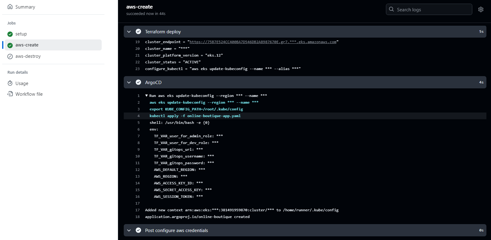

To connect with another user, create access keys and export them, i.e. `AWS_ACCESS_KEY_ID` and `AWS_SECRET_ACCESS_KEY` in the current terminal session.

Verify with `aws sts get-caller-identity`.

```bash
eval $(aws sts assume-role --role-arn "arn:aws:iam::<ID>:role/external-admin" --role-session-name "K8Session" | jq -r '.Credentials | "export AWS_ACCESS_KEY_ID=\(.AccessKeyId) AWS_SECRET_ACCESS_KEY=\(.SecretAccessKey) AWS_SESSION_TOKEN=\(.SessionToken)"')
```

Verify with `aws sts get-caller-identity`.

Authenticate with eks: `aws eks --region eu-north-1 update-kubeconfig --name myapp-eks`.

List all pods deployed in the `argocd` namespace: `kubectl get pod -n argocd`.

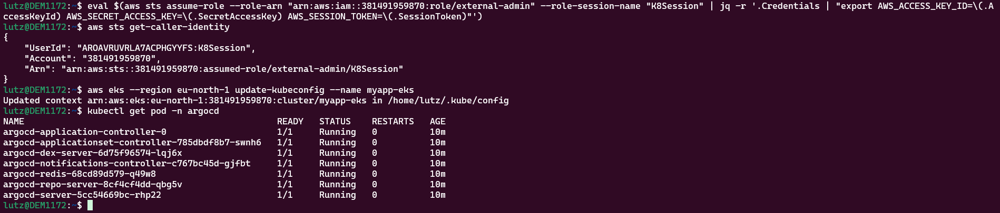

Retrieve the ArgoCD UI password for login: `kubectl get secret -n argocd argocd-initial-admin-secret -o jsonpath="{.data.password}" | base64 -d`.

Localhost port-forwarding to be able to access the ArgoCD UI:

```bash
kubectl describe pod argocd-server-... -n argocd
kubectl port-forward -n argocd pods/argocd-server-... 8080:8080
```

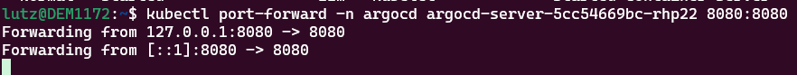

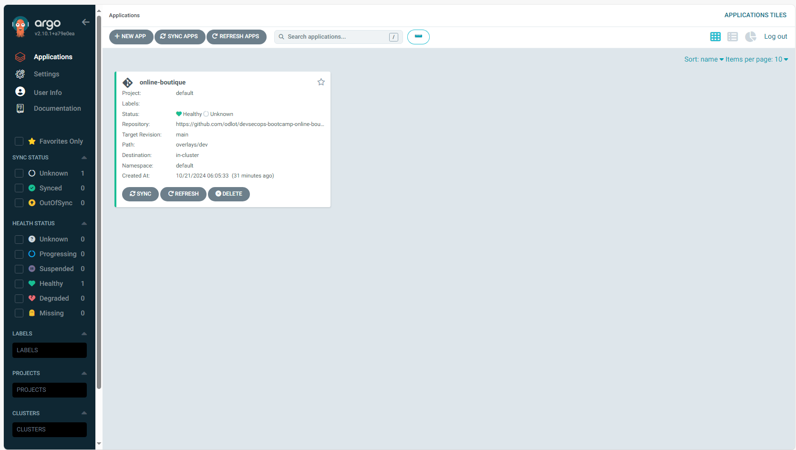

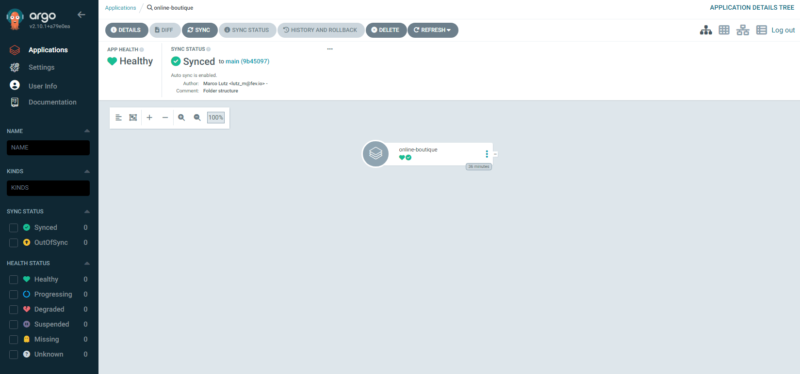

### Project 23 - Part 2

**Description**: Automatically deploy K8s manifest files in Cluster via ArgoCD

- Write K8s manifest files for all microservices
- Write K8s manifest for external access using Ingress
- ArgoCD deploys microservices automatically as soon as manifest files are pushed into Git repository

**Used technologies**:

- Kubenertes
- Kustomize
- ArgoCD
- Git
- AWS EKS

**Reference**: 16.08

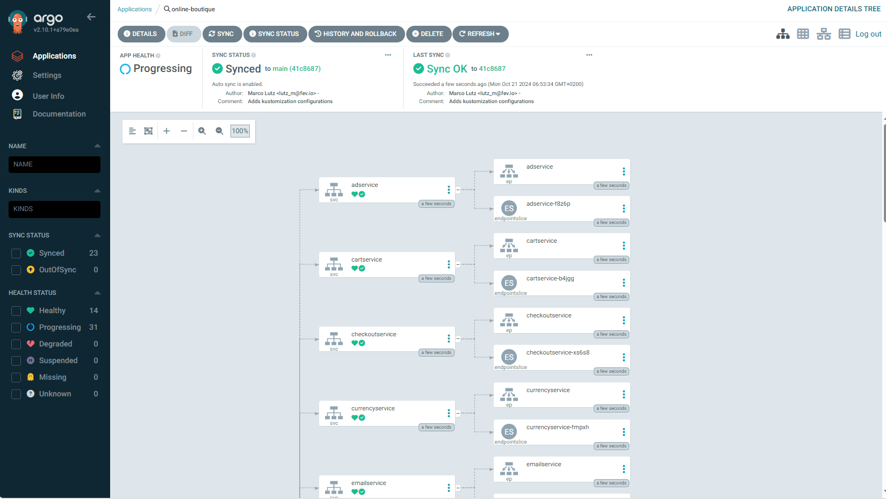

**Note**: I was running a lower maximum size in my terraform scripts to save cost which led to pods being unschedulable.
After increasing the maximum size everything synced and was fine.


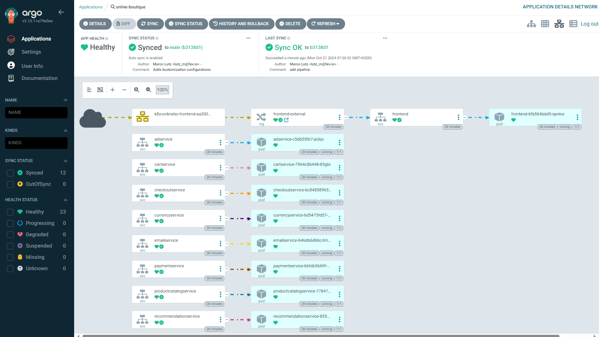

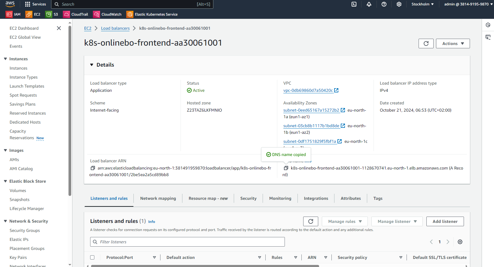

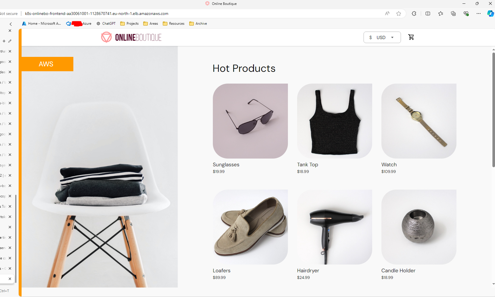

### Project 23 - Part 3

**Description**: Create Pipeline for GitOps project to update Kustomization file

- Configure GitHub CI pipeline
  - to update image version of updated microservice in Kustomization file
  - and push commit to Git repository
- Configure GitHub access with project deploy token

**Used technologies**:

- Kubenertes
- Kustomize
- ArgoCD
- Git

**Reference**: 16.09

### Project 23 - Part 4

**Description**: Create Pipeline for microservices application that triggers gitops pipeline

- Create CI pipeline for microservices that
  - tests the code
  - scans for security vulnerabilities
  - builds and pushes to Docker repository
- Add job to CI pipeline that triggers the GitOps pipeline and passes environment variables
- Full CI/CD pipeline is triggered, where ArgoCD deploy the app as soon as code is pushed to Git repository by GitHub CI

**Used technologies**:

- Kubenertes
- Kustomize
- ArgoCD
- Git

**Reference**: 16.10

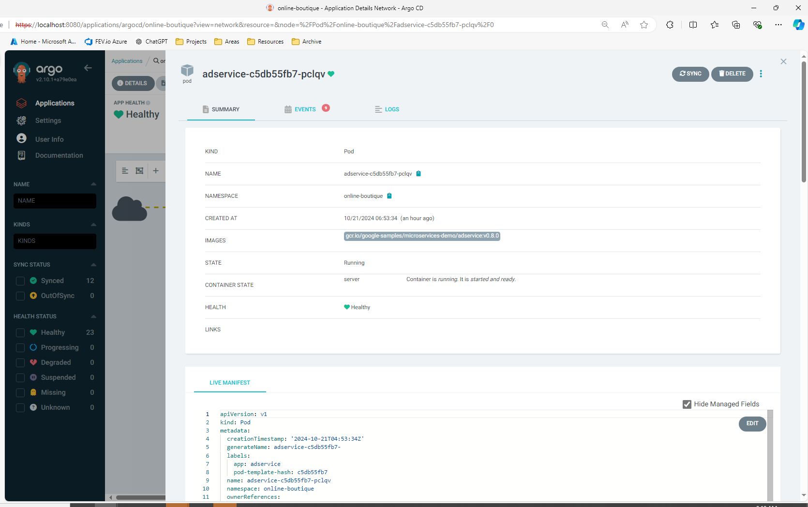
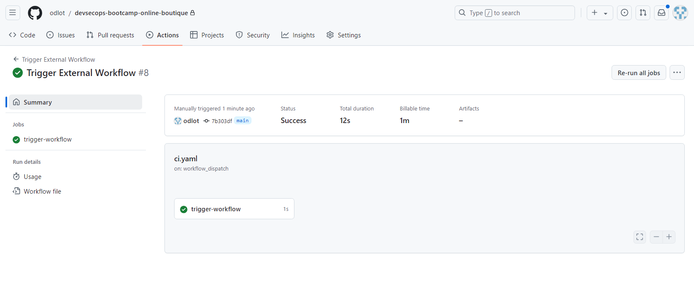
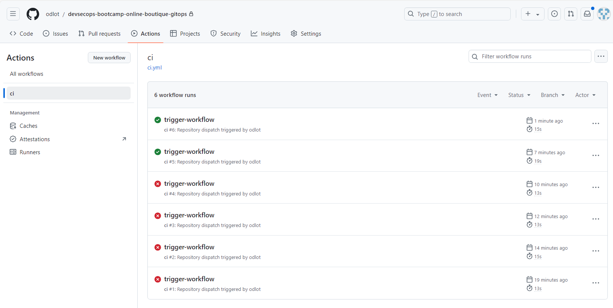
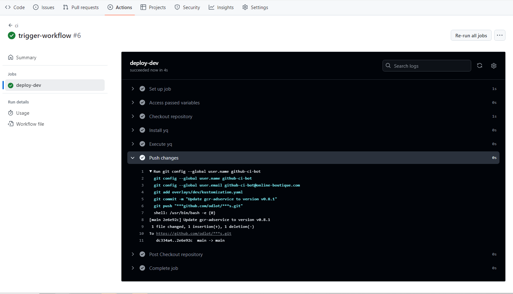

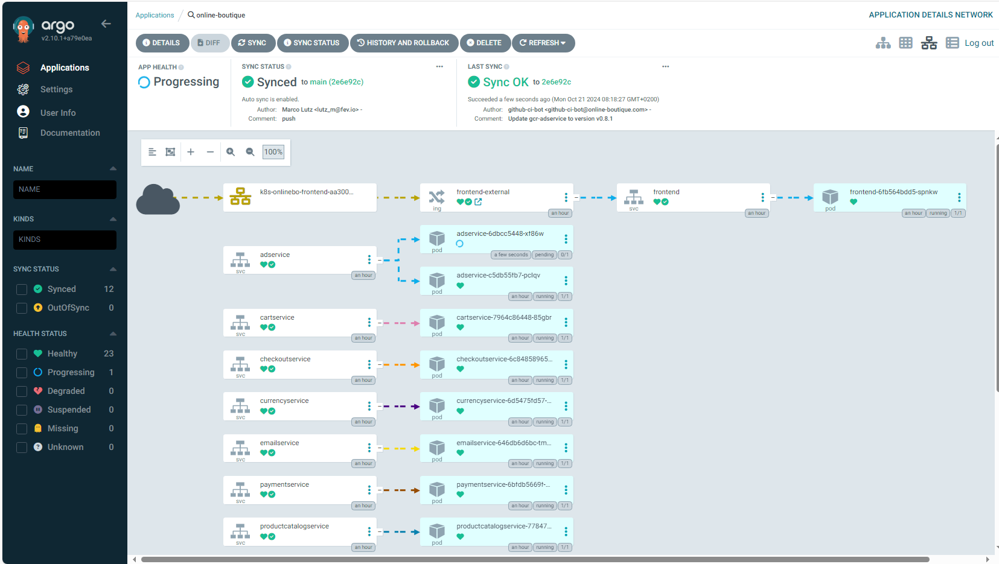
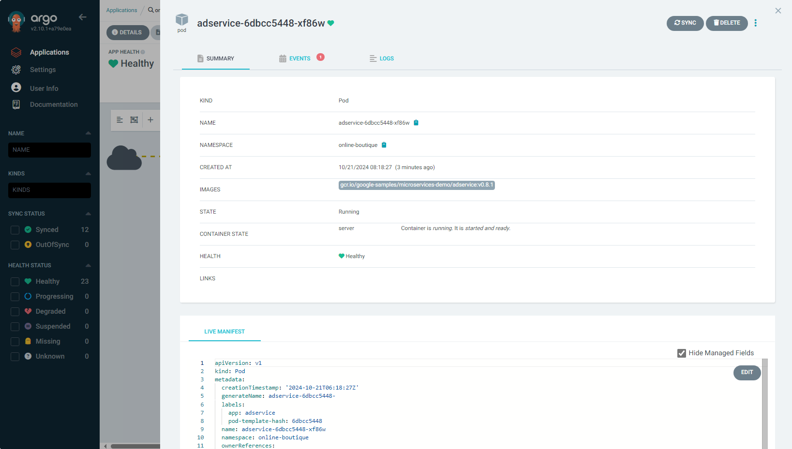

## Project 27

**Description**: Deploy OPA Gatekeeper in EKS Cluster using IaC Pipeline

- Configure Gatekeeper in Terraform using Helm Chart
- Execute IaC Pipeline to deploy OPA Gatekeeper in EKS cluster

**Used technologies**:

- OPA Gatekeeper
- ArgoCD
- GitLab CI
- AWS EKS
- Terraform
- Kubernetes
- Helm Chart

**Note**: Use AWS user to assume K8s admin role and connect to the EKS cluster.

Check the namespace for the `openpolicyagent` namespace: `kubectl get ns`.
Check what has been deployed into the `openpolicyagent` namespace: `kubectl get all -n openpolicyagent`.
List all gatekeeper `crd` templates available with `kubectl get crd -n openpolicyagent`.

### Project 27 - Part 2

**Description**: Configure policies to enforce best practices automatically: i) Block service with type `NodePort` ii) Disallow priviliged containers

- Create constraint template and constraint manifest files to disallow `NodePort` service types
- Create Kustomization file for deployment
- Create ArgoCD application configuration to sync Git repository
- Adjust GitHub CI IaC pipeline to deploy ArgoCD application
- Push manifest file with service type `NodePort` to test successful rejection by OPA
- Create constraint template and constraint manifest files to disallow privileged containers
- Push manifest file with privileged container configuration to test succesful rejection by OPA

**Used technologies**:

- OPA Gatekeeper
- Kubernetes
- Kustomize
- ArgoCD
- Git
